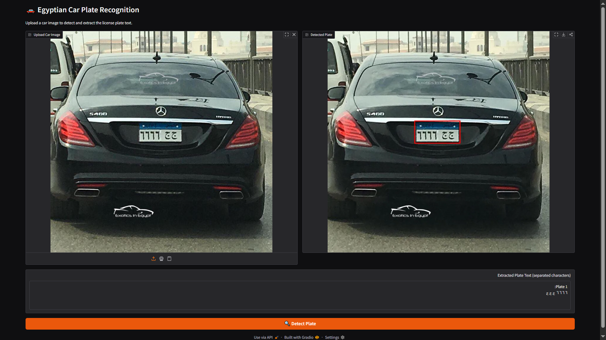

# 🚗 Egyptian Car Plate Recognition

> Detects and extracts text from Egyptian license plates using 
> YOLOv8 + PaddleOCR, deployed as a live web app.

🔗 **Live Demo:** [Try it on Hugging Face](https://huggingface.co/spaces/Maria253/Egyptian_car_plate_detection_OCR_system)

---

## 📸 Demo


---
## Overview
This project focuses on detecting and extracting text from Egyptian car plate licenses using advanced deep learning models. It consists of three primary stages: training a YOLOv8 model for plate detection, testing the model on new data, and using PaddleOCR to extract text from the detected plates.

## 🧠 How It Works

```
Input Image → YOLOv8 (detect plate) → Crop → PaddleOCR (read text) → Result
```

1. YOLOv8 detects the license plate bounding box
2. The plate region is cropped from the original image  
3. PaddleOCR extracts the Arabic/English text

---

## 🛠️ Tech Stack

| Component | Technology |
|---|---|
| Dataset | Roboflow |
| Object Detection | YOLOv8 (Ultralytics) |
| OCR | PaddleOCR |
| API Framework | FastAPI |
| UI | Gradio |
| Deployment | Hugging Face Spaces + Docker |

---

## 📦 Run Locally

```bash
git clone https://github.com/MariAnwar/Egyptian-Car-Plate-Recognition-System
cd Egyptian-Car-Plate-Recognition-System
python -m venv venv && source venv/bin/activate
pip install -r requirements.txt
python app/gradio_app.py
```

---

## 📁 Project Structure

```
├── app/
│   ├── main.py          # FastAPI REST API
│   ├── model.py         # YOLOv8 + PaddleOCR pipeline
│   ├── gradio_app.py    # Gradio web interface
│   └── utils.py         # Image utilities
├── models/              # Trained YOLO weights
├── notebooks/           # Original experiments
└── Dockerfile
```
